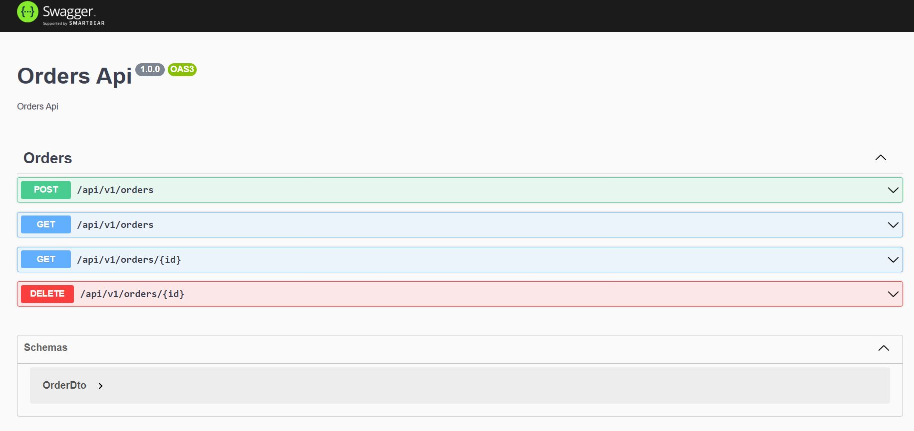

# Orders Service

Order service of backend for setel interview test.

Api(s):

- List of orders
- View order by id
- Create order
- Consume payment api from other service
- Cancel order

## Swagger Links

```bash
http://localhost:3000/api/v1/
```



## Installation

```bash
$ npm install
```

## Running the app

```bash
# development
$ npm run start

# watch mode
$ npm run start:dev

```

## Test

```bash
# unit tests
$ npm run test

# e2e tests
$ npm run test:e2e

# test coverage
$ npm run test:cov
```
